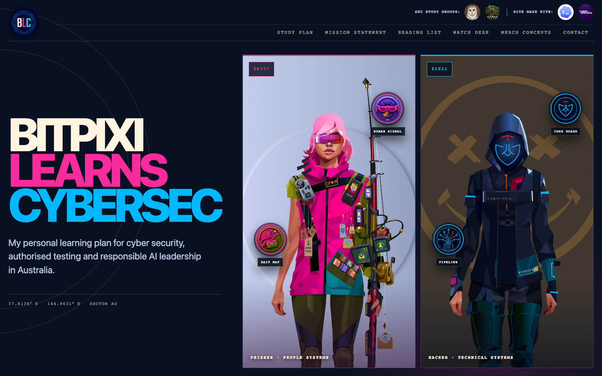
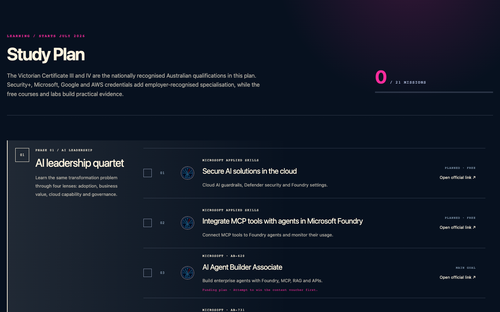
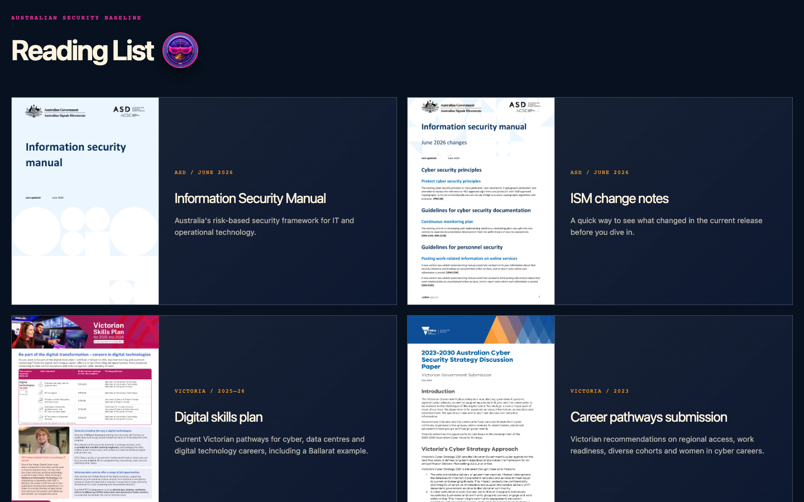
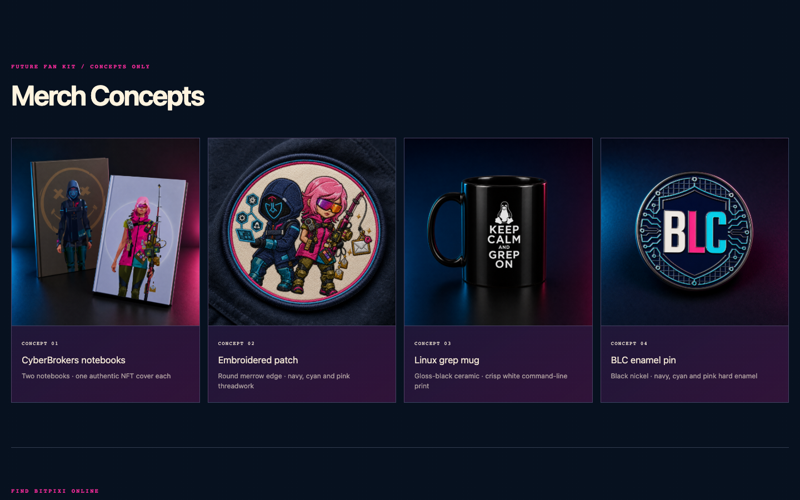

# BITPIXI LEARNS CYBERSEC

A public Australian cyber-security and responsible AI leadership fieldbook about women entering the field, ADHD-friendly learning design and personal study tools built with Codex.

The site pairs two authentic CyberBrokers: #2821 for technical systems and #8377 for people systems. They anchor a 21-mission study checklist, an Australian research watch desk, a curated reading list and a small audit trail.

**[Open the live study plan](https://bitpixi-learns-cybersec.bitpixi.chatgpt.site)**

## Resource directory

### Australian foundations

| Resource | Focus |
| --- | --- |
| [TAFE NSW — Introduction to Linux](https://store.training.tafensw.edu.au/product/introduction-to-linux/) | Free Linux fundamentals |
| [TAFE NSW — Introduction to Data Centres](https://store.training.tafensw.edu.au/product/introduction-to-data-centres/) | Free infrastructure fundamentals |
| [Google Cybersecurity Certificate](https://grow.google/certificates/cybersecurity/) | Linux, SQL, Python, SIEM and incident response |
| [AWSN — CompTIA Security+ training](https://www.awsn.org.au/Web/web/education-training/comp-tia-security-training.aspx) | Possible subsidised Security+ pathway |
| [VU Certificate III in Information Technology](https://www.vu.edu.au/courses/certificate-iii-in-information-technology-ict30120) | Planned Victorian prerequisite; wait for PR eligibility |
| [VU Certificate IV in Cyber Security](https://www.vu.edu.au/courses/certificate-iv-in-cyber-security-22603vic) | Nationally recognised Victorian cyber qualification; wait for PR eligibility |

**[Study Plan](https://bitpixi-learns-cybersec.bitpixi.chatgpt.site/#roadmap)** — 21 missions across AI leadership, Australian foundations and authorised testing.

### AI leadership and governance

| Resource | Focus |
| --- | --- |
| [Microsoft Applied Skills — Secure AI solutions](https://learn.microsoft.com/en-us/credentials/applied-skills/secure-ai-solutions-in-the-cloud/) | Cloud AI guardrails and Defender controls |
| [Microsoft Applied Skills — Integrate MCP tools](https://learn.microsoft.com/en-us/credentials/applied-skills/integrate-model-context-protocol-tools-with-agents-in-microsoft-foundry/) | Foundry agents, MCP tools and monitoring |
| [Microsoft AI Agent Builder Associate — AB-620](https://learn.microsoft.com/en-us/credentials/certifications/ai-agent-builder-associate/) | Enterprise agents, RAG, MCP and APIs |
| [Microsoft AI Transformation Leader — AB-731](https://learn.microsoft.com/en-us/credentials/certifications/ai-transformation-leader/) | Responsible adoption and business change |
| [Google Cloud Generative AI Leader](https://cloud.google.com/learn/certification/generative-ai-leader) | GenAI strategy and responsible adoption |
| [AWS Certified AI Practitioner](https://aws.amazon.com/certification/certified-ai-practitioner/) | Foundation models, security and governance |
| [IAPP AI Governance Professional](https://iapp.org/certify/aigp) | AI lifecycle governance, law, risk and trust |

### Hands-on security and authorised testing

| Resource | Focus |
| --- | --- |
| [Centri Blue Team Junior Analyst pathway](https://www.centri.org/courses/blue-team-junior-analyst-pathway-bundle) | Free defensive skills diagnostic |
| [TryHackMe](https://tryhackme.com/) | Guided cyber labs |
| [PortSwigger Web Security Academy](https://portswigger.net/web-security) | Free authorised web-security labs |
| [PortSwigger Burp Suite Certified Practitioner](https://portswigger.net/web-security/certification) | Practical web-security examination |
| [Microsoft Security, Compliance and Identity Fundamentals — SC-900](https://learn.microsoft.com/en-us/credentials/certifications/security-compliance-and-identity-fundamentals/) | Microsoft security fundamentals |
| [Microsoft Security Operations Analyst — SC-200](https://learn.microsoft.com/en-us/credentials/certifications/security-operations-analyst/) | Sentinel, Defender, KQL and threat hunting |
| [CREST certifications](https://www.crest-approved.org/skills-certifications-careers/crest-certifications/) | Australia and New Zealand penetration-testing pathway |
| [OffSec PEN-200 and OSCP+](https://www.offsec.com/courses/pen-200/) | Advanced practical penetration testing |

**[Reading List](https://bitpixi-learns-cybersec.bitpixi.chatgpt.site/#reading)** — Australian frameworks, Linux, AI social engineering and advanced defender books.

### Australian frameworks and reading

| Resource | Focus |
| --- | --- |
| [ASD Information Security Manual — June 2026](https://www.cyber.gov.au/sites/default/files/2026-06/Information%20security%20manual%20%28June%202026%29.pdf) | Australian risk-based security controls |
| [ISM June 2026 change notes](https://www.cyber.gov.au/sites/default/files/2026-06/ISM%20June%202026%20changes%20%28June%202026%29.pdf) | Current ISM changes |
| [Victorian Digital Technologies Skills Plan 2025–26](https://www.vic.gov.au/sites/default/files/2026-04/fact-sheet-digital-technologies-victorian-skills-plan-for-2025-into-2026.pdf) | Victorian digital career pathways |
| [Victorian cyber-strategy submission](https://www.homeaffairs.gov.au/reports-and-pubs/PDFs/2023-2030-aus-cyber-security-strategy-discussion-paper/Victorian-Government-submission.PDF) | Regional access, work readiness and diverse cohorts |
| [Women in Cyber Security pilot brief](https://www.premier.vic.gov.au/sites/default/files/2022-05/220513%20-%20Creating%20More%20Jobs%20For%20Women%20In%20Cyber%20Security.pdf) | Victorian mentoring, internships and leadership archive |
| [Australia's National AI Plan 2025](https://www.industry.gov.au/sites/default/files/2025-12/national-ai-plan.pdf) | National AI capability, benefit and safety plan |

### Books

| Book | Focus |
| --- | --- |
| [*Just for Fun*](https://www.goodreads.com/book/show/160171.Just_for_Fun) | Linus Torvalds, Linux and open-source culture |
| [*Deceptive Intelligence*](https://link.springer.com/book/9798868821769) | AI-enabled social engineering, phishing and deepfakes |
| [*The Active Defender*](https://www.wiley-vch.de/de/fachgebiete/computer-und-informatik/the-active-defender-978-1-119-89521-3) | Offensive thinking for defenders |
| [*Practical Threat Detection Engineering*](https://www.oreilly.com/library/view/practical-threat-detection/9781801076715/) | ATT&CK, detection-as-code and adversary emulation |
| [*Evading EDR*](https://nostarch.com/evading-edr) | Detection-aware attacks and endpoint-defence limits |
| [*The Developer's Playbook for Large Language Model Security*](https://www.oreilly.com/library/view/the-developers-playbook/9781098162191/) | Prompt injection, trust boundaries and LLM application security |

**[Merch Concepts](https://bitpixi-learns-cybersec.bitpixi.chatgpt.site/#merch)** — CyberBrokers notebooks, embroidered patch, Linux mug and BLC pin.

### Australian watch desk

| Resource | Focus |
| --- | --- |
| [National Anti-Scam Centre](https://www.scamwatch.gov.au/stop-check-protect/help-to-spot-and-avoid-scams/how-scammers-use-technology-and-ai) | AI-assisted scams targeting Australians |
| [ASD Annual Cyber Threat Report](https://www.cyber.gov.au/about-us/view-all-content/reports-and-statistics/annual-cyber-threat-report-2024-2025) | Australia's current threat picture |
| [Australian Institute of Criminology](https://www.aic.gov.au/publications/sb/sb51) | AI-enabled crime, impersonation and fraud research |
| [eSafety deepfake research](https://www.esafety.gov.au/industry/tech-trends-and-challenges/deepfakes) | Synthetic-media harms and detection limits |
| [OAIC guidance on commercial AI products](https://www.oaic.gov.au/privacy/privacy-guidance-for-organisations-and-government-agencies/guidance-on-privacy-and-the-use-of-commercially-available-ai-products) | Australian privacy obligations and AI |
| [National AI Centre](https://www.industry.gov.au/science-technology-and-innovation/technology/artificial-intelligence/national-ai-centre) | Responsible organisational AI adoption |

### Communities

- [OwlSec](https://discord.com/invite/owls)
- [Kanga Root](https://discord.gg/DSnxTcqA5F)

## Audit trail

This repository is intentionally reviewable. Start with the live response headers or [`/.well-known/security.txt`](https://bitpixi-learns-cybersec.bitpixi.chatgpt.site/.well-known/security.txt), then find the short character exchange without testing real systems or third parties.

- [`SECURITY.md`](SECURITY.md) defines the authorised, low-rate and non-destructive testing scope.
- [`Woodsy-Dusty-threat-model.md`](Woodsy-Dusty-threat-model.md) documents trust boundaries, abuse paths and residual risks.
- [`public/field-notes/patch-the-plan.json`](public/field-notes/patch-the-plan.json) is a quick learning-design Easter egg starring #8377 and #2821.

The Easter egg shows its flag directly and has no entry form. Study progress is non-sensitive browser-local state; the application has no user accounts, application database or analytics collector.

## Architecture

The application is a React 19 and Next.js 16 fieldbook compiled by Vinext for a Cloudflare Worker-compatible runtime. The Worker centralises security headers and dispatches the page renderer and allowlisted image optimisation. Public assets are immutable source artifacts; progress remains in `localStorage` on the visitor's own device.

The original CyberBrokers SVGs, PNG renders and metadata snapshots live in `public/nft/`. They are intentionally public and are not secrets or access controls.

## Commands

- `npm run dev` starts local development.
- `npm run build` creates the production build.
- `npm test` builds and verifies the rendered fieldbook and audit artifacts.
- `npm run lint` runs the code-quality checks.
