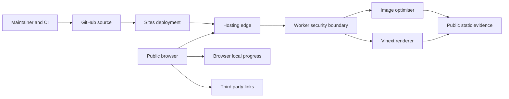

# Woodsy-Dusty threat model

## Executive summary

BITPIXI LEARNS CYBERSEC is a public, mostly static learning fieldbook with no application accounts, sensitive server-side data or state-changing API. Its meaningful risks are source/deployment supply-chain compromise, abuse of the public image transformation surface, unsafe handling of active static formats, misleading testing scope and reputational harm through changed third-party destinations. The highest-priority control is protecting the integrity of source and deployment workflows; visitor progress is intentionally low-sensitivity, device-local state.

## Scope and assumptions

- In scope: `app/`, `worker/`, `public/`, `tests/`, build configuration, GitHub workflows and Sites deployment metadata.
- Runtime: an internet-exposed Vinext/Next.js application behind the Sites/Cloudflare edge, with the Worker entry point in `worker/index.ts`.
- Data sensitivity: public content plus non-sensitive mission IDs stored in the visitor's browser under `bitpixi-cybersec-progress-v1` (`app/page.tsx#STORAGE_KEY`).
- Authentication and tenancy: no application authentication, protected pages, user accounts or multi-tenant application data.
- Persistence: no configured D1 or R2 binding (`.openai/hosting.json`) and no application database modules.
- Authorised testing: low-rate and non-destructive testing of the exact production host and synthetic challenge paths only. Third-party infrastructure and linked sites are out of scope.
- Open questions: provider-level request logging, WAF configuration and deployment-account protections are controlled outside this repository. A future addition of accounts, submissions, uploads or server persistence would materially change the rankings.

## System model

### Primary components

- Browser UI: React client component, local mission progress and outbound links (`app/page.tsx#Home`).
- Edge and Worker: request dispatch, image optimisation and central response headers (`worker/index.ts#fetch`, `worker/index.ts#withSecurityHeaders`).
- Vinext renderer: server-rendered Next.js application shell (`app/layout.tsx#RootLayout`).
- Static evidence: images, NFT metadata, disclosure files, synthetic incident and detection artifacts (`public/`).
- Build and release: npm lockfile, GitHub Actions and Sites source/version deployment (`package-lock.json`, `.github/workflows/`, `.openai/hosting.json`).

### Data flows and trust boundaries

- Internet → hosting edge: request paths, query parameters and headers cross HTTPS; provider controls TLS, coarse abuse protection and platform routing. The application performs no identity check.
- Hosting edge → Worker: untrusted HTTP requests reach `worker.fetch`; central headers are added to every returned response.
- Worker → image optimiser: `/_vinext/image` accepts a same-origin image path, quality and allowlisted width. Vinext rejects absolute/protocol-relative paths, unsafe types and oversized widths before transformation.
- Worker → Vinext renderer/static assets: route path selects public HTML or repository-controlled assets. There is no request body parser or application write path.
- Browser → local storage: a set of public mission IDs is read and written on the visitor's device. Parse failures fail open to an empty progress state and never grant privilege.
- Browser → external sites: user-selected HTTPS links leave the application with `rel="noreferrer"`; destination content and availability are outside the trust boundary.
- Maintainer → GitHub/Sites: trusted source and workflow changes become public build artifacts. Compromise here can replace the entire application.

#### Diagram

## Assets and security objectives

| Asset | Why it matters | Security objective (C/I/A) |
| --- | --- | --- |
| Source and deployment integrity | A compromised build could impersonate Bitpixi or serve hostile browser code | I, A |
| Visitor privacy | The app promises no application analytics or answer collection | C |
| Fieldbook content and brand | Incorrect or altered advice creates professional and reputational harm | I |
| Synthetic incident and detections | The exercise must remain internally consistent and clearly fictional | I |
| Browser progress | Users should not unexpectedly lose their own checklist state | I, A (low sensitivity) |
| Public availability | The portfolio should remain reachable without expensive application work | A |

## Attacker model

### Capabilities

- Send unauthenticated HTTP requests, enumerate predictable public paths and vary image optimiser parameters.
- Modify their own browser storage and client-side execution environment.
- Follow or share third-party links and attempt to confuse readers about what is authorised.
- Attempt dependency, maintainer-account or CI compromise through channels outside normal application requests.

### Non-capabilities

- There are no application credentials, privileged roles, submission endpoints or user records to steal.
- A remote visitor cannot modify repository-controlled content through the deployed application.
- The policy does not grant permission to test the hosting platform, adjacent tenants or linked services.

## Entry points and attack surfaces

| Surface | How reached | Trust boundary | Notes | Evidence (repo path / symbol) |
| --- | --- | --- | --- | --- |
| Home and generated routes | Public HTTPS GET | Internet → Worker → renderer | Static authored content; no body parsing | `worker/index.ts#fetch`, `app/page.tsx#Home` |
| Image optimiser | `/_vinext/image` query parameters | Internet → image transform | Width allowlist and Vinext URL/content-type validation | `worker/index.ts#fetch` |
| Public static assets | Predictable GET paths | Internet → asset store | Includes JSON, PNG and first-party SVG | `public/` |
| Browser progress | Local UI toggles | Page script → browser storage | Mission IDs only; storage is untrusted and non-authoritative | `app/page.tsx#toggleMission` |
| Outbound links | User click | Site → third-party origin | New tab plus `noreferrer`; destination remains external | `app/page.tsx` |
| Build and release | Maintainer push/workflow | Developer/CI → production | Highest-integrity boundary | `.github/workflows/`, `.openai/hosting.json` |

## Top abuse paths

1. An attacker compromises a maintainer or dependency, changes the build, and deploys browser code that impersonates Bitpixi or redirects visitors.
2. A bot repeatedly requests expensive permitted image sizes and qualities, consuming transformation capacity and degrading availability.
3. A future contributor replaces a same-origin SVG with active content; a visitor opens it as a document and script executes under the site origin.
4. A researcher misreads the challenge as a general bug bounty and probes the shared hosting platform or linked organisations, creating third-party harm.
5. A linked provider or social destination is compromised; visitors trust the fieldbook link and encounter hostile content after leaving the origin.
6. A visitor or extension tampers with local progress data; parsing or unexpected mission IDs distort only that visitor's checklist.
7. Predictable NFT metadata paths are enumerated and mistaken for an information leak even though the assets are intentionally public.

## Threat model table

| Threat ID | Threat source | Prerequisites | Threat action | Impact | Impacted assets | Existing controls (evidence) | Gaps | Recommended mitigations | Detection ideas | Likelihood | Impact severity | Priority |
| --- | --- | --- | --- | --- | --- | --- | --- | --- | --- | --- | --- | --- |
| TM-001 | Supply-chain or account attacker | Compromise of a maintainer, dependency or deployment credential | Publish altered client or Worker code | Site impersonation, malicious redirects, brand damage | Source, deployment, visitors, brand | Lockfile and read-only workflow permissions (`package-lock.json`, `.github/workflows/ci.yml`) | Provider account controls are not represented in repo | Require MFA, review dependency updates, protect `main`, keep CI least-privileged and review release diffs | GitHub secret scanning, Dependabot, CodeQL, deployment-change review | Medium | High | High |
| TM-002 | Remote unauthenticated bot | Ability to call the public image route repeatedly | Consume image transformation capacity with valid requests | Degraded availability or provider cost | Availability | Strict width/quality/path and safe content-type validation in Vinext; edge hosting (`worker/index.ts#fetch`) | Application-specific rate metrics are unavailable | Retain edge rate controls; monitor provider usage; disable optimisation if it becomes unnecessary | Alert on spikes by route/status at provider edge | Medium | Medium | Medium |
| TM-003 | Malicious or compromised source contributor | Ability to replace a repository-controlled SVG | Insert script or external loads into an active image document | Same-origin script execution when opened directly | Visitors, origin integrity | SVG responses receive sandboxed CSP and `nosniff` (`worker/index.ts#withSecurityHeaders`); current SVGs are source-controlled | No automated SVG sanitizer | Continue static scans for script/event handlers; consider raster-only public delivery if assets change | CI grep/lint for active SVG constructs and unexpected diffs | Low | High | Medium |
| TM-004 | Curious researcher or scanner | Encounters audit breadcrumb or challenge | Tests third-party or shared infrastructure beyond permission | External harm, complaints, reputational damage | Brand, third parties | Explicit scope, prohibited actions and synthetic labels (`SECURITY.md`, `public/security-policy.txt`) | Policy cannot technically constrain external actors | Keep exact-host language prominent and avoid deceptive targets | Review inbound reports; retain policy timestamps | Medium | Medium | Medium |
| TM-005 | Compromised third-party destination | A linked site's content or account changes after publication | Serve phishing or malicious content after a trusted click | Visitor harm outside the application origin | Visitors, brand | Explicit links, new tabs and `rel="noreferrer"` (`app/page.tsx`) | No continuous destination reputation monitoring | Periodically verify high-value links and remove stale destinations | Scheduled link check plus manual review | Low | Medium | Low |
| TM-006 | Local user, extension or prior XSS on the same origin | Access to the visitor's browser storage | Modify or corrupt stored mission IDs | Incorrect personal progress display | Browser progress | Only public IDs are stored; JSON errors fail safely (`app/page.tsx#restoreProgress`) | No schema filter for unknown IDs | Filter restored IDs against the mission catalog; keep storage non-sensitive | Client-side error telemetry only if added with consent | Medium | Low | Low |
| TM-007 | Remote enumerator | Knowledge of token IDs or common NFT paths | Enumerate JSON/SVG/PNG assets | Public metadata is copied or mischaracterised as secret | Public content, brand | README and control manifest declare assets public (`README.md`, `public/field-notes/2821.json`) | Asset licensing context is not machine-enforced | Preserve provenance and do not place confidential data under `public/` | Repository review for new public files | High | Low | Low |
| TM-008 | Application or platform regression | Header wrapper or build output changes | Security headers disappear or CSP is prematurely enforced | Reduced browser hardening or broken hydration | Visitors, availability | Header and artifact regression tests (`tests/security-artifacts.test.mjs`) | Report-only CSP has no collection endpoint by design | Keep CSP report-only until nonce-compatible testing; verify live headers after deploy | CI tests and periodic live header checks | Low | Medium | Low |

## Criticality calibration

- Critical: pre-auth code execution in the Worker; theft of deployment credentials with active malicious release; cross-tenant platform access caused by application code.
- High: source/deployment compromise serving hostile JavaScript; broad visitor-data exfiltration if future telemetry or accounts are added; persistent same-origin active-content compromise.
- Medium: sustained image-transform abuse; testing-scope ambiguity that harms a third party; a contained active-format issue requiring a source change.
- Low: tampered local progress; enumeration of intentionally public NFT metadata; missing hardening headers with no exploitable injection path.

## Focus paths for security review

| Path | Why it matters | Related Threat IDs |
| --- | --- | --- |
| `worker/index.ts` | Central request dispatch, image transformation and response security policy | TM-002, TM-003, TM-008 |
| `app/page.tsx` | Client storage, outbound links and primary rendered content | TM-005, TM-006 |
| `app/layout.tsx` | Canonical metadata and source-visible audit breadcrumbs | TM-004, TM-008 |
| `public/` | Every file is intentionally internet-readable, including active SVG and challenge evidence | TM-003, TM-007 |
| `SECURITY.md` | Defines the exact authorisation boundary and safe-harbour promise | TM-004 |
| `package.json` and `package-lock.json` | Dependency and build integrity | TM-001 |
| `.github/workflows/` | Public CI permissions and supply-chain execution | TM-001 |
| `.openai/hosting.json` | Connects validated source to the production Sites project | TM-001 |

### Quality check

- Covered the public renderer, image endpoint, assets, browser storage, outbound links and release workflow.
- Represented every identified runtime and deployment trust boundary in at least one threat.
- Separated the production runtime from tests, build tooling and CI.
- Incorporated the confirmed low-rate, non-destructive and exact-host testing boundary.
- Kept provider logs, WAF and account security as explicit external assumptions.
